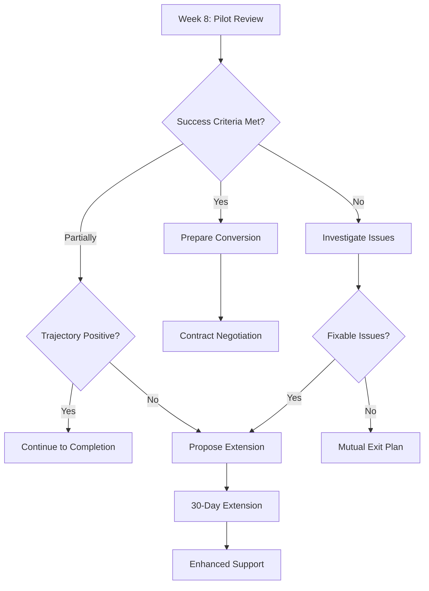

# ROOTUIP Pilot Onboarding Workflow

## Phase 1: Pre-Launch (Days 1-5)

### Day 1: Kickoff Meeting
**Duration**: 2 hours  
**Attendees**: Customer Success Manager, Technical Lead, Customer Stakeholders

**Agenda**:
1. Welcome and introductions (15 min)
2. ROOTUIP platform overview (30 min)
3. Pilot timeline and milestones (30 min)
4. Success criteria review (30 min)
5. Technical requirements discussion (15 min)
6. Q&A and next steps (10 min)

**Deliverables**:
- [ ] Signed pilot agreement
- [ ] Contact information sheet
- [ ] Technical requirements checklist
- [ ] Meeting recording and notes

### Day 2-3: Data Integration Planning
**Technical Discovery Session**

**Data Source Mapping**:
```yaml
customer_systems:
  tms:
    system_name: ""
    api_available: true/false
    authentication_method: ""
    data_refresh_rate: ""
  
  erp:
    system_name: ""
    integration_type: ""
    data_fields_available: []
  
  other_systems:
    - name: ""
      purpose: ""
      integration_method: ""
```

**Integration Checklist**:
- [ ] API credentials obtained
- [ ] Test environment access
- [ ] Data field mapping completed
- [ ] Historical data export initiated
- [ ] Security requirements validated

### Day 4-5: Technical Integration
**Integration Tasks**:
1. Configure API connections
2. Set up data pipelines
3. Validate data quality
4. Test real-time updates
5. Configure error handling

**Validation Tests**:
- [ ] Data completeness (>95%)
- [ ] Update latency (<5 minutes)
- [ ] Historical data loaded (12 months)
- [ ] User authentication working
- [ ] Alert webhooks configured

## Phase 2: Training & Configuration (Days 6-10)

### Day 6-7: User Training Program

**Session 1: Platform Fundamentals** (2 hours)
- Navigation and UI overview
- Understanding D&D predictions
- Using the risk dashboard
- Setting up alerts
- Hands-on exercises

**Session 2: Advanced Features** (2 hours)
- ML insights interpretation
- Custom report creation
- Bulk operations
- API usage for power users
- Integration with existing workflows

**Training Materials**:
- [ ] User guide PDF
- [ ] Video tutorials (5)
- [ ] Quick reference card
- [ ] Admin guide
- [ ] API documentation

### Day 8-9: Configuration & Customization

**Dashboard Setup**:
```javascript
// Customer-specific dashboard configuration
const pilotDashboardConfig = {
  customer: "CUSTOMER_NAME",
  widgets: [
    {
      type: "risk_overview",
      position: { x: 0, y: 0, w: 6, h: 4 },
      config: {
        threshold_high: 70,
        threshold_medium: 40,
        refresh_interval: 300
      }
    },
    {
      type: "savings_tracker",
      position: { x: 6, y: 0, w: 6, h: 4 },
      config: {
        baseline_dnd_rate: 0.06,
        target_prevention_rate: 0.94
      }
    },
    {
      type: "shipment_timeline",
      position: { x: 0, y: 4, w: 12, h: 6 },
      config: {
        days_ahead: 14,
        show_predictions: true
      }
    }
  ],
  alerts: [
    {
      name: "High Risk Shipment",
      condition: "risk_score > 70",
      channels: ["email", "slack"],
      recipients: ["ops-team@customer.com"]
    },
    {
      name: "D&D Prevented",
      condition: "dd_prevented == true",
      channels: ["dashboard"],
      track_savings: true
    }
  ]
};
```

**Process Integration**:
- [ ] Define escalation procedures
- [ ] Map to existing SOPs
- [ ] Configure automated workflows
- [ ] Set up reporting schedule
- [ ] Create user groups and permissions

### Day 10: Go-Live Preparation

**Pre-Launch Checklist**:
- [ ] All users trained and activated
- [ ] Data flowing correctly
- [ ] Alerts configured and tested
- [ ] Success metrics baseline captured
- [ ] Support channels established
- [ ] First week schedule confirmed

## Phase 3: Active Pilot (Days 11-70)

### Week 1: Intensive Support
**Daily Check-ins** (30 min)
- Review previous day's activity
- Address any issues
- Refine configurations
- Ensure adoption

**Metrics to Track**:
```sql
-- Daily pilot metrics query
SELECT 
  DATE(created_at) as date,
  COUNT(*) as predictions_made,
  AVG(risk_score) as avg_risk_score,
  SUM(CASE WHEN dd_prevented THEN 1 ELSE 0 END) as dd_prevented_count,
  SUM(estimated_savings) as daily_savings,
  COUNT(DISTINCT user_id) as active_users
FROM pilot_activity
WHERE customer_id = :customer_id
  AND DATE(created_at) = CURRENT_DATE - INTERVAL '1 day'
GROUP BY DATE(created_at);
```

### Week 2-8: Optimization Phase
**Weekly Business Reviews** (1 hour)

**Agenda Template**:
1. Performance metrics review (15 min)
2. Success stories and wins (10 min)
3. Challenges and solutions (15 min)
4. Feature requests and feedback (10 min)
5. Next week's focus areas (10 min)

**Weekly Report Sections**:
- Executive summary
- Key performance indicators
- Savings achieved vs. target
- User adoption metrics
- System performance
- Action items

### Week 9-10: Evaluation & Decision

**Final Review Preparation**:
- [ ] Generate comprehensive pilot report
- [ ] Calculate total ROI achieved
- [ ] Document process improvements
- [ ] Collect user testimonials
- [ ] Prepare case study draft
- [ ] Create contract conversion proposal

## Phase 4: Success Metrics Definition

### Business Metrics Framework

**Primary KPIs**:
1. **D&D Prevention Rate**
   - Target: 94%
   - Calculation: (Shipments without D&D / High-risk shipments) × 100

2. **Cost Savings**
   - Target: 20% reduction
   - Calculation: Baseline D&D costs - Current D&D costs

3. **ROI Achievement**
   - Target: 5:1
   - Calculation: (Savings + Efficiency gains) / Pilot investment

**Secondary KPIs**:
1. **User Adoption**
   - Target: >75% daily active users
   - Measurement: Unique logins per day

2. **Prediction Accuracy**
   - Target: >90%
   - Validation: Predicted vs. actual outcomes

3. **Operational Efficiency**
   - Target: 30% reduction in manual reviews
   - Measurement: Time saved on D&D management

### Baseline Establishment

**Week 0 Data Collection**:
```python
# Baseline metrics collection script
baseline_metrics = {
    "monthly_dd_charges": [],
    "dd_incident_rate": 0,
    "avg_dd_duration": 0,
    "manual_review_hours": 0,
    "missed_prevention_opportunities": 0,
    "current_prevention_methods": [],
    "team_size": 0,
    "technology_costs": 0
}

# Calculate baseline over last 12 months
for month in last_12_months:
    metrics = collect_monthly_metrics(month)
    baseline_metrics["monthly_dd_charges"].append(metrics["dd_charges"])
    # ... continue for all metrics

baseline_report = generate_baseline_report(baseline_metrics)
```

## Onboarding Resources

### 1. Welcome Package Contents
- [ ] Welcome letter from CEO
- [ ] Platform access credentials
- [ ] Training schedule
- [ ] Support contact card
- [ ] Quick start guide
- [ ] Pilot timeline poster

### 2. Dedicated Slack Channel Setup
```
Channel: #customer-name-pilot
Purpose: Real-time support and collaboration

Channels structure:
- #general - Announcements and discussions
- #technical-support - Integration and technical issues
- #training - Training resources and Q&A
- #success-metrics - Daily metrics and wins
```

### 3. Support Resources
- **Customer Success Manager**: Direct phone/email
- **Technical Support**: 24/7 helpdesk
- **Knowledge Base**: help.rootuip.com
- **Video Library**: learn.rootuip.com
- **API Documentation**: api.rootuip.com/docs

## Pilot Extension Decision Tree



## Post-Onboarding Support Model

### Weeks 3-10: Steady State Operations
- Weekly check-ins (1 hour)
- Monthly executive reviews
- Quarterly business reviews (post-conversion)
- Annual success planning

### Continuous Improvement
- Feature request tracking
- Regular platform updates
- Industry benchmark sharing
- Peer networking opportunities